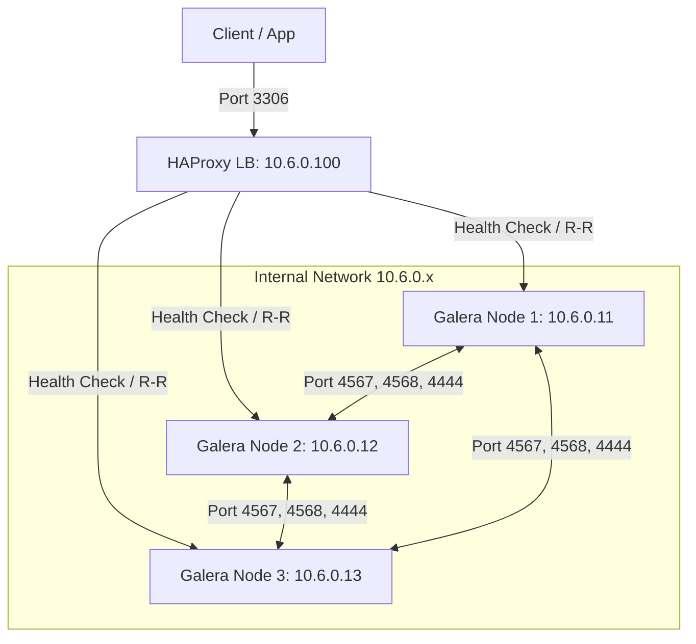
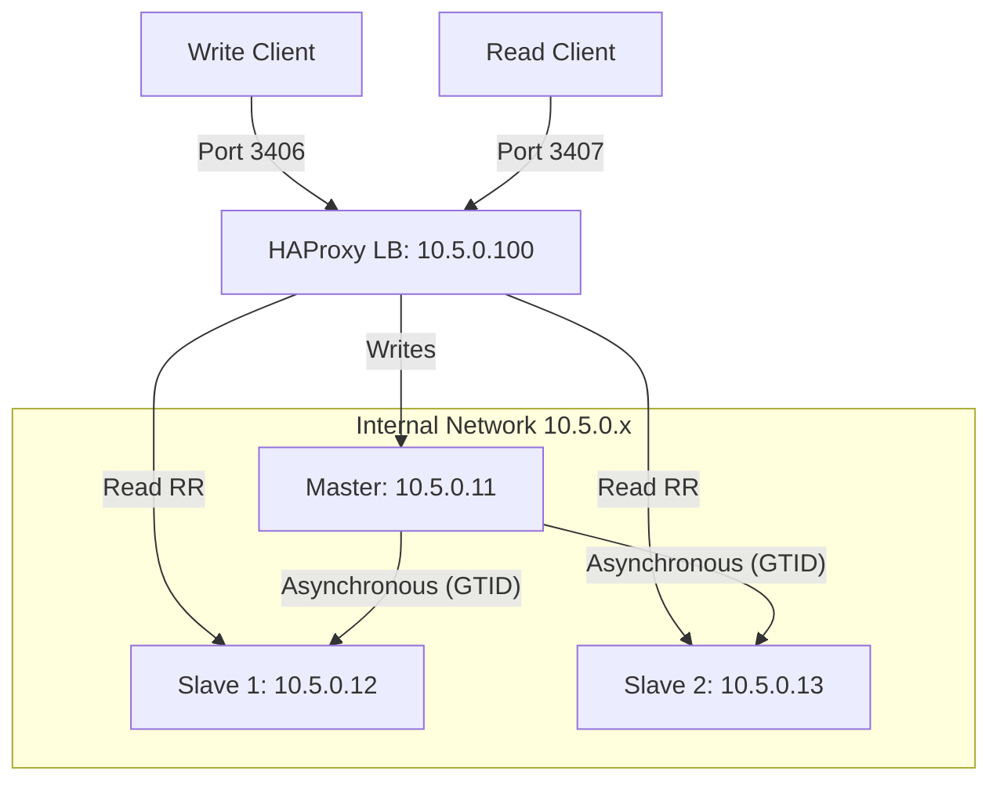

# Global Architecture 🏗️

This document describes the network and server topology of the MariaDB Docker environment.

## 🌐 1. Galera Cluster Architecture

The Galera cluster provides synchronous multi-master replication.

### Network Topology

- **Subnet**: `10.6.0.0/24`
- **Load Balancer**: `10.6.0.100` (HAProxy)

### Diagram

### Access Ports

| Node | MariaDB Port | SSH Port |
| :--- | :--- | :--- |
| Node 1 | 3511 | 22001 |
| Node 2 | 3512 | 24002 |
| Node 3 | 3513 | 24003 |
| HAProxy | 3306 | N/A |

---

## 🔄 2. Replication Cluster Architecture

The replication cluster uses a classic Master/Slave topology with GTID.

### Network Topology

- **Subnet**: `10.5.0.0/24`
- **Load Balancer**: `10.5.0.100` (HAProxy)

### Diagram

### Access Ports

| Node | MariaDB Port | SSH Port | Role |
| :--- | :--- | :--- | :--- |
| Node 1 | 3411 | 23001 | Master |
| Node 2 | 3412 | 23002 | Slave 1 |
| Node 3 | 3413 | 23003 | Slave 2 |
| HAProxy (W) | 3406 | N/A | Entry Point -> Master |
| HAProxy (R) | 3407 | N/A | Entry Point -> Slaves (LB) |
