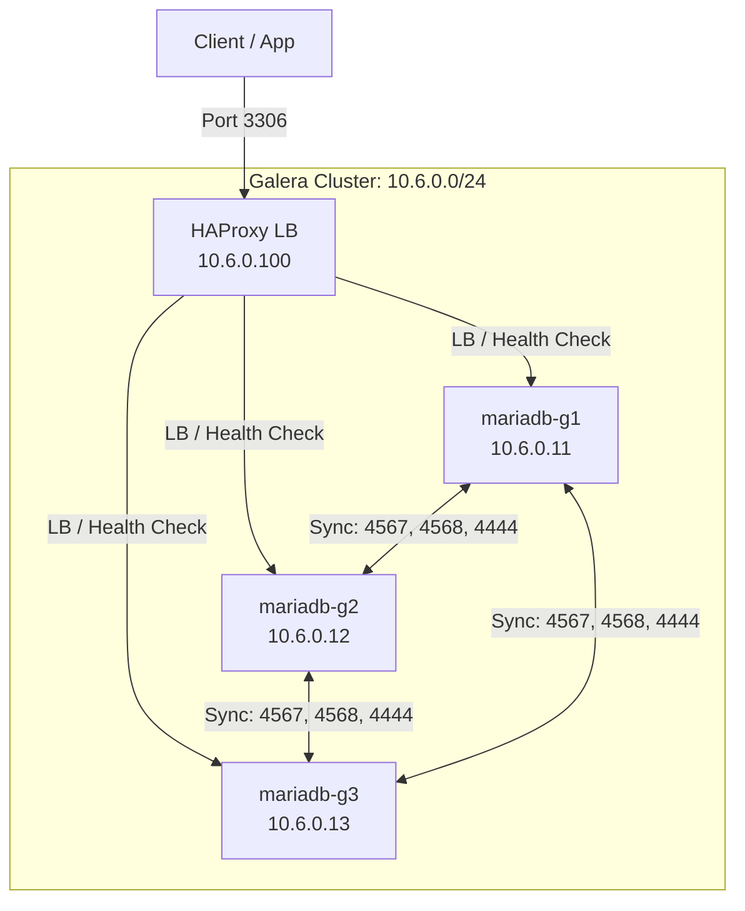

# Global Architecture 🏗️

This document describes the network and server topology of the MariaDB Docker environment.

## 🌐 1. Galera Cluster Architecture

The Galera cluster provides synchronous multi-master replication.

### Network Topology

- **Subnet**: `10.6.0.0/24`
- **Load Balancer**: `10.6.0.100` (HAProxy)

### Diagram



### Access Ports

| Logical Name | Node | IP Address | MariaDB Port | SSH Port |
| :--- | :--- | :--- | :--- | :--- |
| `mariadb-g1` | Node 1 | `10.6.0.11` | 3511 | 22001 |
| `mariadb-g2` | Node 2 | `10.6.0.12` | 3512 | 24002 |
| `mariadb-g3` | Node 3 | `10.6.0.13` | 3513 | 24003 |
| `haproxy_galera` | Load Balancer | `10.6.0.100` | 3306 | N/A |

---

## 🔄 2. Replication Cluster Architecture

The replication cluster uses a classic Master/Slave topology with GTID.

### Network Topology

- **Subnet**: `10.5.0.0/24`
- **Load Balancer**: `10.5.0.100` (HAProxy)

### Diagram

```mermaid
graph TD
    Client_W[Write Client] -->|Port 3406| LB[HAProxy LB<br/>10.5.0.100]
    Client_R[Read Client] -->|Port 3407| LB
    
    subgraph Replication_Topology [Replication: 10.5.0.0/24]
        LB -->|Writes| M1[mariadb-m1 (Master)<br/>10.5.0.11]
        LB -->|Read RR| S1[mariadb-s1 (Slave 1)<br/>10.5.0.12]
        LB -->|Read RR| S2[mariadb-s2 (Slave 2)<br/>10.5.0.13]
        
        M1 --"Async (GTID)"--> S1
        M1 --"Async (GTID)"--> S2
    end
```

### Access Ports

| Logical Name | Node | Role | IP Address | MariaDB Port | SSH Port |
| :--- | :--- | :--- | :--- | :--- | :--- |
| `mariadb-m1` | Node 1 | Master | `10.5.0.11` | 3411 | 23001 |
| `mariadb-s1` | Node 2 | Slave 1 | `10.5.0.12` | 3412 | 23002 |
| `mariadb-s2` | Node 3 | Slave 2 | `10.5.0.13` | 3413 | 23003 |
| `haproxy_repli` | Load Balancer | LB (W/R) | `10.5.0.100` | 3406/3407 | N/A |

### Access Ports

| Node | MariaDB Port | SSH Port | Role |
| :--- | :--- | :--- | :--- |
| Node 1 | 3411 | 23001 | Master |
| Node 2 | 3412 | 23002 | Slave 1 |
| Node 3 | 3413 | 23003 | Slave 2 |
| HAProxy (W) | 3406 | N/A | Entry Point -> Master |
| HAProxy (R) | 3407 | N/A | Entry Point -> Slaves (LB) |
