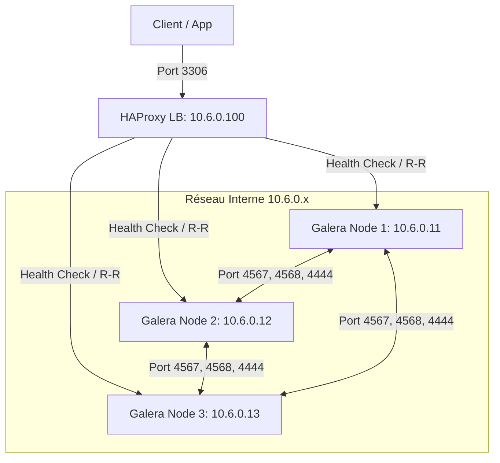
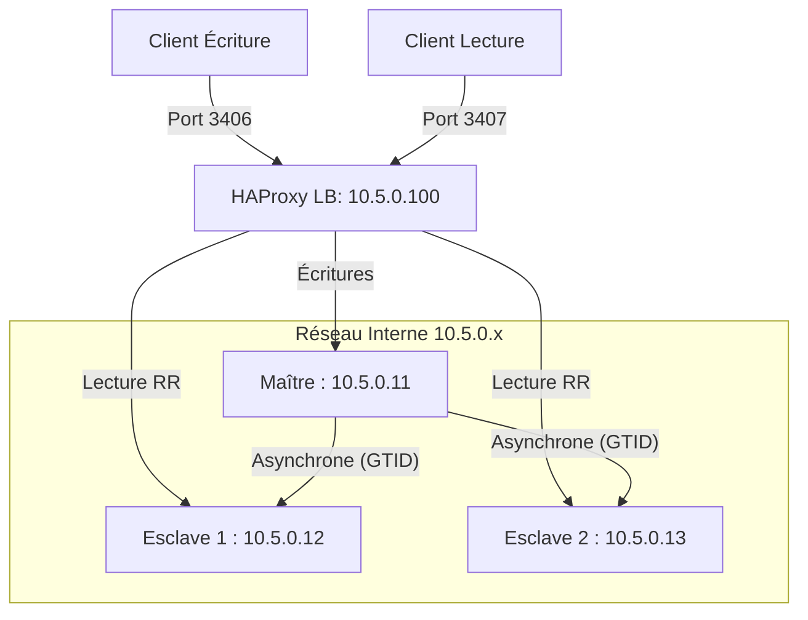

# Architecture Globale 🏗️

Ce document décrit la topologie réseau et serveur de l'environnement Docker MariaDB.

## 🌐 1. Architecture du Cluster Galera

Le cluster Galera fournit une réplication multi-maître synchrone.

### Topologie Réseau

- **Sous-réseau** : `10.6.0.0/24`
- **Répartiteur de charge (LB)** : `10.6.0.100` (HAProxy)

### Schéma

### Ports d'Accès

| Nœud | Port MariaDB | Port SSH |
| :--- | :--- | :--- | :--- |
| Nœud 1 | 3511 | 22001 |
| Nœud 2 | 3512 | 24002 |
| Nœud 3 | 3513 | 24003 |
| HAProxy | 3306 | N/A |

---

## 🔄 2. Architecture du Cluster de Réplication

Le cluster de réplication utilise une topologie classique Maître/Esclave avec GTID.

### Topologie Réseau

- **Sous-réseau** : `10.5.0.0/24`
- **Répartiteur de charge (LB)** : `10.5.0.100` (HAProxy)

### Schéma

### Ports d'Accès

| Nœud | Port MariaDB | Port SSH | Rôle |
| :--- | :--- | :--- | :--- |
| Nœud 1 | 3411 | 23001 | Maître |
| Nœud 2 | 3412 | 23002 | Esclave 1 |
| Nœud 3 | 3413 | 23003 | Esclave 2 |
| HAProxy (W) | 3406 | N/A | Point d'entrée -> Maître |
| HAProxy (R) | 3407 | N/A | Point d'entrée -> Esclaves (LB) |
