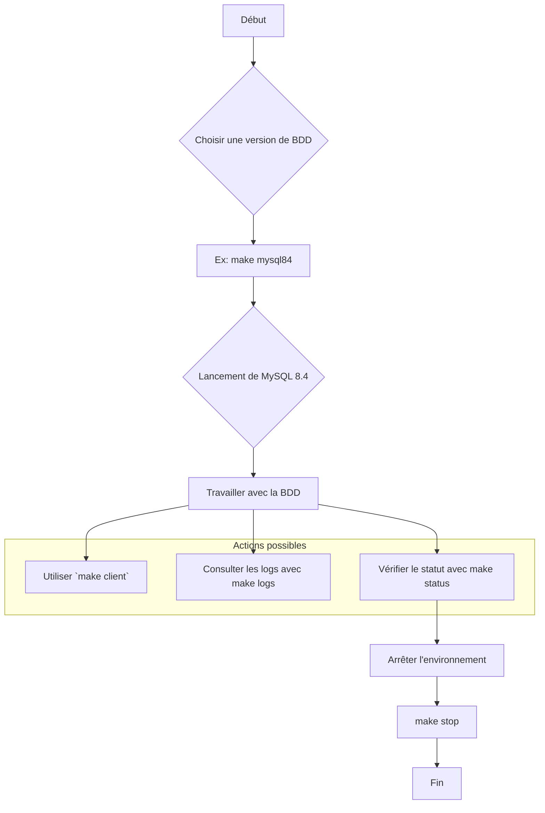

# 🚀 Gestion des Bases de Données avec Docker Compose et Make

Ce projet fournit un ensemble d'outils basés sur `make` et `docker-compose` pour démarrer, gérer et interagir facilement avec différentes versions de serveurs de bases de données (MySQL, MariaDB, Percona). Il est idéal pour des tests de développement locaux.

## 📋 Prérequis

Avant de commencer, assurez-vous d'avoir installé les outils suivants sur votre système :

*   [Docker](https://docs.docker.com/get-docker/)
*   [Docker Compose](https://docs.docker.com/compose/install/)

## 🔧 Configuration Initiale

La seule étape de configuration requise est de créer un fichier `.env` à la racine du projet pour définir le mot de passe root de vos bases de données.

1.  Créez un fichier nommé `.env`.
2.  Ajoutez la ligne suivante en remplaçant `votre_mot_de_passe_secret` par un mot de passe sécurisé :

    ```env
    # Fichier de configuration des variables d'environnement
    DB_ROOT_PASSWORD=votre_mot_de_passe_secret
    ```

Cette variable est essentielle pour que les commandes `mycnf` et `client` fonctionnent correctement.

## 📚 Commandes Disponibles

Le `Makefile` simplifie toutes les interactions avec les conteneurs.

### Commandes Générales

Ces commandes vous aident à gérer l'état de votre environnement.

| Commande | Icône | Description                                                                                                | Exemple d'utilisation |
| :------- | :---- | :--------------------------------------------------------------------------------------------------------- | :-------------------- |
| `help`   | ❓    | Affiche le message d'aide avec la liste de toutes les commandes.                                           | `make help`           |
| `stop`   | 🛑    | Arrête et supprime tous les conteneurs et réseaux gérés par ce projet.                                     | `make stop`           |
| `status` | 📊    | Affiche l'état des conteneurs Docker Compose actifs.                                                       | `make status`         |
| `info`   | ℹ️    | Donne des informations sur le service de base de données actif.                                              | `make info`           |
| `logs`   | 📄    | Affiche les logs en temps réel du service de base de données actif.                                          | `make logs`           |
| `mycnf`  | 🔑    | Génère un fichier `~/.my.cnf` pour se connecter avec le client `mysql` sans saisir de mot de passe.        | `make mycnf`          |
| `client` | 💻    | Lance un client MySQL et se connecte à la base de données active.                                            | `make client`         |

### Démarrage d'une Base de Données

Chaque commande de démarrage arrêtera d'abord toute instance précédemment lancée avant de démarrer la nouvelle, garantissant ainsi qu'une seule base de données tourne à la fois.

**MySQL**

| Commande  | Icône | Description                             |
| :-------- | :---- | :-------------------------------------- |
| `mysql93` | 🐬    | Démarre un conteneur avec MySQL 9.3.    |
| `mysql84` | 🐬    | Démarre un conteneur avec MySQL 8.4.    |
| `mysql80` | 🐬    | Démarre un conteneur avec MySQL 8.0.    |
| `mysql57` | 🐬    | Démarre un conteneur avec MySQL 5.7.    |

**MariaDB**

| Commande     | Icône | Description                               |
| :----------- | :---- | :---------------------------------------- |
| `mariadb114` | 🐧    | Démarre un conteneur avec MariaDB 11.4.   |
| `mariadb1011`| 🐧    | Démarre un conteneur avec MariaDB 10.11.  |
| `mariadb106` | 🐧    | Démarre un conteneur avec MariaDB 10.6.   |

**Percona Server**

| Commande    | Icône | Description                                 |
| :---------- | :---- | :------------------------------------------ |
| `percona84` | ⚡    | Démarre un conteneur avec Percona Server 8.4. |
| `percona80` | ⚡    | Démarre un conteneur avec Percona Server 8.0. |

## 💡 Workflow Typique

Voici un diagramme illustrant un flux de travail courant :



## ✨ Exemple Concret

1.  **Démarrer une base de données** (par exemple, MariaDB 11.4) :
    ```bash
    make mariadb114
    ```

2.  **Générer le fichier de configuration** pour le client MySQL :
    ```bash
    make mycnf
    ```
    Cela vous permettra de vous connecter sans mot de passe depuis votre terminal local.

3.  **Se connecter à la base de données** :
    ```bash
    make client
    ```

4.  **Vérifier les logs** si quelque chose ne va pas :
    ```bash
    make logs
    ```

5.  **Arrêter l'environnement** une fois votre travail terminé :
    ```bash
    make stop
    ```
