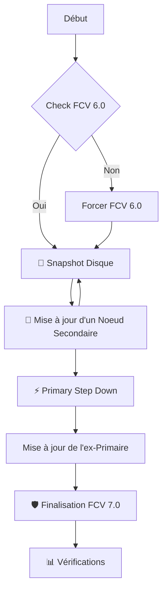

# **🚀 Procédure de Mise à Jour MongoDB (6.0 ➡ 7.0)**

**Contexte :** Mise à jour mineure (7.0.x) ou majeure (6.0 vers 7.0) d'un Replica Set.

**Stratégie :** "Rolling Upgrade" (Nœud par nœud) pour garantir la haute disponibilité (Zero Downtime).

## **📋 Vue d'ensemble du processus**



## **💾 1\. Préparation & Sauvegarde**

Avant toute modification binaire, l'état du cluster doit être validé et sécurisé.

### **1.1 Validation de la compatibilité (FCV)**

Le cluster doit être en mode 6.0 avant de recevoir les binaires 7.0.

| Commande | Description |
| :---- | :---- |
| ```db.adminCommand( { getParameter: 1, featureCompatibilityVersion: 1 }``` ) | **Vérification.** Doit retourner ```{ "featureCompatibilityVersion" : "6.0" }``` |
| ```db.adminCommand( { setFeatureCompatibilityVersion: "6.0" } )``` | **Correction.** Force la compatibilité 6.0 si nécessaire. |

### **1.2 Snapshot Disque (Critique)**

⚠️ **Ne pas passer cette étape.**

Effectuer un snapshot du volume de données (LVM, EBS, Datastore) sur le nœud cible avant arrêt.

## **🔄 2\. Mise à jour des Nœuds Secondaires**

Cette boucle doit être exécutée pour **chaque membre Secondary**, un par un.

1. **Arrêt du service :**  
   ```bash
   sudo systemctl stop mongod
   ```

2. **Mise à jour des paquets (OS level) :**  

   ```bash
   # Debian / Ubuntu  
   sudo apt-get update && sudo apt-get install \-y mongodb-org  
   # RHEL / CentOS  
   sudo yum update \-y mongodb-org
   ```
   
4. **Redémarrage du service :**  
   ```sudo systemctl start mongod```

5. **Validation de la reprise :**  
   Attendre que le nœud passe de STARTUP2 / RECOVERING à SECONDARY.  
   ```rs.status().members.find(m \=\> m.self).stateStr```

## **⚡ 3\. Bascule du Primaire (Primary Step Down)**

Une fois tous les secondaires en version 7.0, le Primaire (toujours en 6.0) doit passer la main.

**Exécuter sur le nœud PRIMAIRE actuel :**

```
// Force le nœud à devenir Secondaire et interdit son élection pendant 60s  
// Cela laisse le temps aux autres nœuds (déjà en 7.0) d'élire un nouveau leader.  
rs.stepDown(60)
```

**Action immédiate :** Une fois le nœud devenu SECONDARY, appliquez la procédure de la **section 2** (Arrêt, Update, Start) sur ce serveur.

## **🛡️ 4\. Finalisation de la Migration**

Une fois que **100% des nœuds** tournent avec les binaires 7.0 et sont sains.

### **Activation des fonctionnalités 7.0**

Cette commande est irréversible sans restauration de snapshot.

```db.adminCommand( { setFeatureCompatibilityVersion: "7.0" } )```

## **📊 5\. Commandes de Vérification**

Voici le kit de vérification pour valider l'état post-migration.

### **État de santé global**

```rs.status()```

### **Tableau de bord des rôles**

Ce script imprime un résumé clair des priorités et statuts de chaque membre.
```js
rs.conf().members.forEach(function(member) {  
    print(  
        "Host: " \+ member.host.padEnd(25) \+   
        "| Prio: " \+ member.priority \+   
        " | Hidden: " \+ member.hidden \+   
        " | Votes: " \+ member.votes \+  
        " | ID: " \+ member.\_id  
    );  
})
```
### **Vérification rapide du rôle local**

db.isMaster().ismaster  // Retourne true si Primaire  
